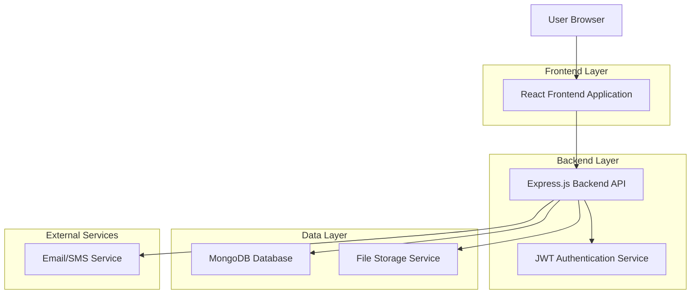
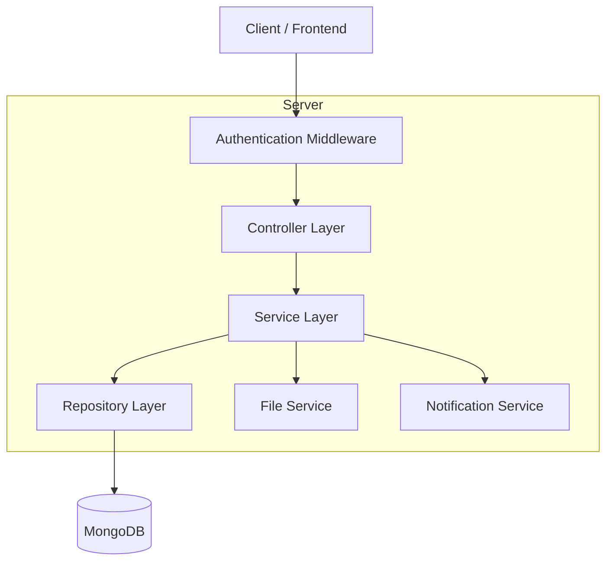
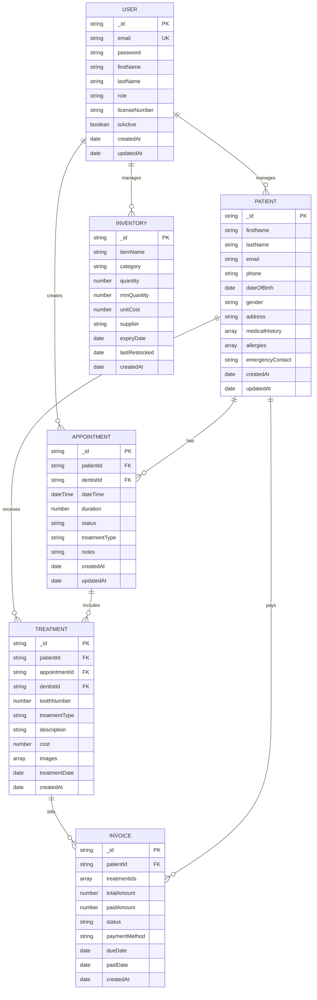

# Dental Automation System - Technical Architecture Document

## 1. Architecture Design



## 2. Technology Description

- **Frontend**: React@18 + TypeScript + Vite + Tailwind CSS@3
- **State Management**: Zustand
- **UI Components**: Headless UI + Lucide React icons
- **Backend**: Express.js@4 + TypeScript
- **Database**: MongoDB
- **Authentication**: JWT tokens
- **File Storage**: Local storage with cloud backup
- **Communication**: Email service + SMS notifications

## 3. Route Definitions

| Route | Purpose |
|-------|---------|
| / | Login page for system access |
| /dashboard | Main dashboard with system overview |
| /patients | Patient management and listing |
| /patients/new | Add new patient form |
| /patients/:id | Individual patient profile and history |
| /appointments | Appointment scheduling and calendar |
| /appointments/new | Create new appointment |
| /treatments | Treatment records and dental charting |
| /invoices | Billing and invoice management |
| /inventory | Dental supplies and inventory |
| /reports | Analytics and reporting |
| /settings | System configuration and user management |

## 4. API Definitions

### 4.1 Authentication APIs

**Login**
```
POST /api/auth/login
```

Request:
| Param Name | Param Type | isRequired | Description |
|------------|------------|------------|-------------|
| email | string | true | User email address |
| password | string | true | User password |
| role | string | true | User role (dentist/assistant/receptionist) |

Response:
| Param Name | Param Type | Description |
|------------|------------|-------------|
| token | string | JWT authentication token |
| user | object | User profile data |
| role | string | User role with permissions |

### 4.2 Patient Management APIs

**Create Patient**
```
POST /api/patients
```

Request:
| Param Name | Param Type | isRequired | Description |
|------------|------------|------------|-------------|
| firstName | string | true | Patient first name |
| lastName | string | true | Patient last name |
| email | string | false | Patient email |
| phone | string | true | Patient phone number |
| dateOfBirth | date | true | Patient birth date |
| medicalHistory | array | false | Medical conditions |
| allergies | array | false | Known allergies |

**Get Patients**
```
GET /api/patients?page=1&limit=10&search=keyword
```

**Update Patient**
```
PUT /api/patients/:id
```

**Delete Patient**
```
DELETE /api/patients/:id
```

### 4.3 Appointment APIs

**Create Appointment**
```
POST /api/appointments
```

Request:
| Param Name | Param Type | isRequired | Description |
|------------|------------|------------|-------------|
| patientId | string | true | Patient ID |
| dentistId | string | true | Dentist ID |
| dateTime | datetime | true | Appointment date and time |
| duration | number | true | Duration in minutes |
| treatmentType | string | true | Type of treatment |
| notes | string | false | Additional notes |

**Get Appointments**
```
GET /api/appointments?date=2024-01-01&dentistId=xxx
```

### 4.4 Treatment APIs

**Record Treatment**
```
POST /api/treatments
```

Request:
| Param Name | Param Type | isRequired | Description |
|------------|------------|------------|-------------|
| patientId | string | true | Patient ID |
| appointmentId | string | true | Appointment ID |
| toothNumber | number | true | Tooth number (1-32) |
| treatmentType | string | true | Treatment type |
| description | string | true | Treatment description |
| cost | number | true | Treatment cost |
| images | array | false | Treatment images/X-rays |

### 4.5 Invoice APIs

**Create Invoice**
```
POST /api/invoices
```

Request:
| Param Name | Param Type | isRequired | Description |
|------------|------------|------------|-------------|
| patientId | string | true | Patient ID |
| treatments | array | true | Array of treatment IDs |
| totalAmount | number | true | Total invoice amount |
| paymentMethod | string | true | Payment method |
| dueDate | date | true | Payment due date |

## 5. Server Architecture Diagram



## 6. Data Model

### 6.1 Database Schema Design



### 6.2 Data Definition Language

**Users Collection**
```javascript
{
  _id: ObjectId,
  email: String,
  password: String, // Hashed
  firstName: String,
  lastName: String,
  role: String, // 'dentist', 'assistant', 'receptionist'
  licenseNumber: String,
  isActive: Boolean,
  permissions: [String],
  createdAt: Date,
  updatedAt: Date
}
```

**Patients Collection**
```javascript
{
  _id: ObjectId,
  firstName: String,
  lastName: String,
  email: String,
  phone: String,
  dateOfBirth: Date,
  gender: String,
  address: {
    street: String,
    city: String,
    state: String,
    zipCode: String
  },
  medicalHistory: [{
    condition: String,
    diagnosedDate: Date,
    status: String
  }],
  allergies: [String],
  emergencyContact: {
    name: String,
    phone: String,
    relationship: String
  },
  dentalHistory: [{
    treatmentId: ObjectId,
    date: Date,
    notes: String
  }],
  createdAt: Date,
  updatedAt: Date
}
```

**Appointments Collection**
```javascript
{
  _id: ObjectId,
  patientId: ObjectId,
  dentistId: ObjectId,
  dateTime: Date,
  duration: Number, // minutes
  status: String, // 'scheduled', 'confirmed', 'completed', 'cancelled', 'no-show'
  treatmentType: String,
  notes: String,
  remindersSent: [{
    type: String, // 'email', 'sms'
    sentAt: Date
  }],
  createdAt: Date,
  updatedAt: Date
}
```

**Treatments Collection**
```javascript
{
  _id: ObjectId,
  patientId: ObjectId,
  appointmentId: ObjectId,
  dentistId: ObjectId,
  toothNumber: Number, // 1-32
  toothSurface: String, // 'mesial', 'distal', 'occlusal', etc.
  treatmentType: String, // 'filling', 'crown', 'extraction', etc.
  description: String,
  cost: Number,
  images: [{
    filename: String,
    path: String,
    uploadedAt: Date
  }],
  materialsUsed: [{
    inventoryId: ObjectId,
    quantity: Number,
    cost: Number
  }],
  treatmentDate: Date,
  nextAppointmentNeeded: Boolean,
  nextAppointmentDate: Date,
  createdAt: Date
}
```

**Invoices Collection**
```javascript
{
  _id: ObjectId,
  invoiceNumber: String,
  patientId: ObjectId,
  treatmentIds: [ObjectId],
  subtotal: Number,
  tax: Number,
  totalAmount: Number,
  paidAmount: Number,
  status: String, // 'pending', 'partial', 'paid', 'overdue'
  paymentMethod: String,
  dueDate: Date,
  paidDate: Date,
  payments: [{
    amount: Number,
    method: String,
    date: Date,
    reference: String
  }],
  createdAt: Date
}
```

**Inventory Collection**
```javascript
{
  _id: ObjectId,
  itemCode: String,
  itemName: String,
  category: String, // 'materials', 'tools', 'medications'
  description: String,
  quantity: Number,
  minQuantity: Number,
  unit: String,
  unitCost: Number,
  supplier: {
    name: String,
    contact: String,
    email: String
  },
  expiryDate: Date,
  batchNumber: String,
  location: String,
  lastRestocked: Date,
  createdAt: Date
}
```

## 7. Security Considerations

### 7.1 Role-Based Access Control (RBAC)

**User Roles and Permissions:**
- **Dentist**: Full access to all patient data, treatments, and can generate invoices
- **Assistant**: Can view patient data, schedule appointments, update treatments under supervision
- **Receptionist**: Can manage appointments, patient registration, and handle payments

### 7.2 Data Encryption
- Passwords hashed using bcrypt with salt rounds of 12
- Sensitive patient data encrypted at rest using AES-256
- HTTPS enforced for all API communications
- JWT tokens with 1-hour expiration and refresh token mechanism

### 7.3 Input Validation and Sanitization
- All user inputs validated using Joi schema validation
- SQL injection prevention through parameterized queries
- XSS protection through input sanitization
- File upload restrictions (type, size, virus scanning)

### 7.4 API Security
- Rate limiting: 100 requests per minute per IP
- API key authentication for external integrations
- CORS configured for specific origins only
- Request logging and audit trails

## 8. Deployment Architecture

### 8.1 Development Environment
```bash
# Local development setup
npm install
npm run dev:frontend
npm run dev:backend
```

### 8.2 Production Deployment Strategy
- **Frontend**: Static files served via CDN (CloudFlare)
- **Backend**: Node.js application on AWS EC2 / DigitalOcean
- **Database**: MongoDB Atlas for managed database service
- **File Storage**: AWS S3 for medical images and documents
- **Load Balancer**: Nginx for reverse proxy and SSL termination

### 8.3 Database Backup Procedures
- Daily automated backups at 2 AM
- 30-day retention policy
- Cross-region backup replication
- Point-in-time recovery capability

### 8.4 Monitoring and Logging
- **Application Monitoring**: PM2 for process management
- **Log Aggregation**: Winston logger with daily rotation
- **Error Tracking**: Sentry for real-time error monitoring
- **Performance Monitoring**: New Relic / DataDog
- **Health Checks**: Automated uptime monitoring

## 9. Integration Points

### 9.1 Email Service Integration
- **Service**: SendGrid / AWS SES
- **Templates**: Appointment reminders, invoice notifications, treatment follow-ups
- **Triggers**: Automated based on appointment status changes

### 9.2 SMS Notifications
- **Service**: Twilio
- **Use Cases**: Appointment reminders, emergency notifications
- **Rate Limiting**: Max 3 SMS per patient per day

### 9.3 File Storage for Medical Images
- **Primary Storage**: AWS S3 with encryption
- **Backup**: Cross-region replication
- **Access Control**: Signed URLs with expiration
- **Supported Formats**: JPEG, PNG, PDF, DICOM

### 9.4 Backup and Data Export
- **Automated Backup**: Daily full database backup
- **Data Export**: CSV/JSON export for reporting
- **Compliance**: HIPAA-compliant data handling
- **Retention**: 7 years for medical records

## 10. Performance Optimization

### 10.1 Database Optimization
- Indexed fields: email, patientId, appointmentDate
- Compound indexes for frequent queries
- Database connection pooling
- Query result caching with Redis

### 10.2 Frontend Optimization
- Code splitting and lazy loading
- Image optimization and WebP format
- Service worker for offline functionality
- Bundle size optimization

### 10.3 API Optimization
- Response compression (gzip)
- Pagination for large datasets
- Field selection for reduced payload
- ETags for conditional requests

## 11. Compliance and Standards

### 11.1 HIPAA Compliance
- Encrypted data transmission and storage
- Access logging and audit trails
- User authentication and authorization
- Data breach notification procedures

### 11.2 Data Privacy
- GDPR compliance for EU patients
- Consent management system
- Right to data portability
- Right to erasure (where applicable)

### 11.3 Medical Standards
- ICD-10 code support for diagnoses
- Dental procedure coding (CDT codes)
- Medical image standards (DICOM support)
- Electronic prescription integration ready