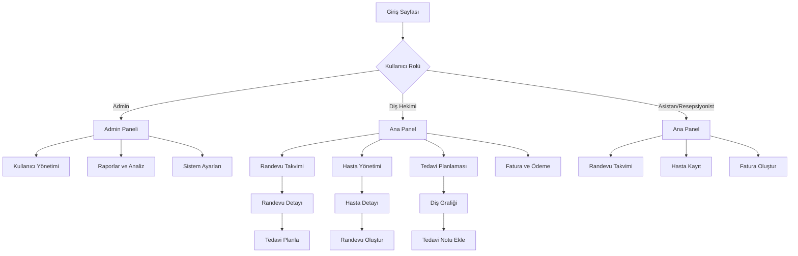

## 1. Ürün Genel Bakış
Modern web tabanlı bir diş kliniği yönetim sistemi. Türk diş klinikleri için özel olarak tasarlanmıştır.

Sistem, diş hekimlerinin hasta kayıtlarını dijital ortamda yönetmelerini, randevuları planlamalarını, tedavi süreçlerini takip etmelerini ve klinik operasyonlarını otomatikleştirmelerini sağlar. Hasta bakım kalitesini artırırken, klinik verimliliğini optimize eder.

## 2. Temel Özellikler

### 2.1 Kullanıcı Rolleri

| Rol | Kayıt Yöntemi | Temel İzinler |
|------|---------------------|------------------|
| Admin/Diş Hekimi | Sistem yöneticisi tarafından oluşturulur | Tüm sisteme tam erişim, kullanıcı yönetimi, raporlama |
| Diş Hekimi | Admin tarafından davetiye ile kayıt | Hasta verileri, tedavi planlaması, randevular |
| Asistan | Admin/Diş Hekimi tarafından kayıt | Hasta verileri görüntüleme, randevu planlama, envanter |
| Resepsiyonist | Admin tarafından kayıt | Randevu yönetimi, fatura oluşturma, hasta kaydı |

### 2.2 Özellik Modülü

Sistem aşağıdaki temel sayfalardan oluşur:

1. **Giriş Sayfası**: Kullanıcı girişi, şifre yenileme, dil seçeneği
2. **Ana Panel**: Klinik genel durumu, bugünkü randevular, hızlı erişim menüsü
3. **Hasta Yönetimi**: Hasta listesi, yeni hasta kaydı, hasta detayları
4. **Randevu Takvimi**: Günlük/haftalık/aylık görünüm, randevu oluşturma/düzenleme
5. **Tedavi Planlaması**: Diş grafikleri, tedavi notları, ilerleme takibi
6. **Fatura ve Ödeme**: Fatura oluşturma, ödeme takibi, finansal raporlar
7. **Envanter Yönetimi**: Malzeme stoğu, sipariş takibi, kullanım kayıtları
8. **Raporlar ve Analiz**: Klinik performans, gelir gider analizi, istatistikler
9. **Ayarlar**: Kullanıcı profili, sistem ayarları, yedekleme

### 2.3 Sayfa Detayları

| Sayfa Adı | Modül Adı | Özellik Açıklaması |
|-----------|-------------|---------------------|
| Giriş Sayfası | Kimlik Doğrulama | Kullanıcı adı ve şifre ile giriş, şifremi unuttum, otomatik oturum açma |
| Ana Panel | Genel Bakış | Bugünkü randevular, acak durumlar, hızlı istatistikler, kısayollar |
| Ana Panel | Bildirimler | Yaklaşan randevular, düşük stok uyarıları, sistem mesajları |
| Hasta Yönetimi | Hasta Listesi | Tüm hastaların listesi, arama ve filtreleme, dışa aktarma |
| Hasta Yönetimi | Yeni Hasta | Ad, soyad, TC kimlik, telefon, adres, doğum tarihi, cinsiyet |
| Hasta Yönetimi | Hasta Detayı | Kişisel bilgiler, tıbbi geçmiş, tedavi geçmişi, ödemeler, notlar |
| Hasta Yönetimi | Tıbbi Geçmiş | Alerjiler, kullanılan ilaçlar, sistemik hastalıklar, önceki tedaviler |
| Randevu Takvimi | Takvim Görünümü | Günlük, haftalık, aylık görünüm, sürükle-bırak ile randevu taşıma |
| Randevu Takvimi | Randevu Oluştur | Hasta seçimi, tarih/saat, tedavi türü, doktor ataması, not ekleme |
| Randevu Takvimi | Randevu Yönetimi | Randevu durumu (beklemede/onaylandı/iptal), hatırlatma ayarları |
| Tedavi Planlaması | Diş Grafiği | 32 dişin grafiksel gösterimi, diş durumu renk kodlaması |
| Tedavi Planlaması | Tedavi Notları | Tedavi açıklaması, kullanılan malzemeler, süre, ücretlendirme |
| Tedavi Planlaması | İlerleme Takibi | Tedavi aşamaları, fotoğraf ekleme, tarihçe, sonraki randevu |
| Fatura ve Ödeme | Fatura Oluştur | Hasta bilgileri, tedavi kalemleri, toplam tutar, KDV hesaplama |
| Fatura ve Ödeme | Ödeme Takibi | Nakit/kredi kartı/havale, taksitlendirme, ödeme geçmişi |
| Fatura ve Ödeme | Finansal Raporlar | Günlük/aylık/yıllık gelir, en çok kazandıran tedaviler, borçlar |
| Envanter Yönetimi | Stok Takibi | Malzeme listesi, miktar, birim fiyat, minimum stok seviyesi |
| Envanter Yönetimi | Sipariş Yönetimi | Tedarikçi bilgileri, sipariş geçmişi, teslimat takibi |
| Envanter Yönetimi | Kullanım Kaydı | Hangi hastada hangi malzeme kullanıldı, tarih, miktar |
| Raporlar | Klinik Raporları | Toplam hasta sayısı, yeni kayıtlar, tedavi istatistikleri |
| Raporlar | Finansal Analiz | Gelir-gider karşılaştırması, karlılık analizi, trend grafikleri |
| Raporlar | Doktor Performans | Tedavi sayıları, gelir katkısı, hasta memnuniyeti |
| Ayarlar | Kullanıcı Profili | Ad-soyad, unvan, iletişim bilgileri, profil fotoğrafı |
| Ayarlar | Klinik Ayarları | Klinik adı, adres, telefon, çalışma saatleri, tatil günleri |
| Ayarlar | Veri Yedekleme | Manuel/otomatik yedekleme, dışa aktarma, geri yükleme |

## 3. Temel İşlem Akışları

### Normal Kullanıcı Akışı (Resepsiyonist/Asistan)
1. Sisteme giriş yap
2. Ana panelden günlük randevuları görüntüle
3. Yeni hasta kaydı oluştur veya mevcut hastayı bul
4. Randevu oluştur veya düzenle
5. Gerekli durumlarda fatura oluştur
6. Çıkış yap

### Diş Hekimi Akışı
1. Sisteme giriş yap
2. Randevu takviminden günlük programı görüntüle
3. Hasta dosyasını aç ve tıbbi geçmişi incele
4. Diş grafik üzerinde tedavi planla
5. Tedavi notlarını kaydet
6. Gerekli malzemeleri envanterden düş
7. Fatura oluştur veya resepsiyona yönlendir
8. Çıkış yap

### Admin Akışı
1. Sisteme yönetici olarak giriş yap
2. Kullanıcıları yönet (ekleme/düzenleme/silme)
3. Klinik ayarlarını yapılandır
4. Finansal raporları incele
5. Veri yedeklemelerini kontrol et
6. Sistem performansını izle

## 4. Kullanıcı Arayüzü Tasarımı

### 4.1 Tasarım Stili
- **Ana Renkler**: Beyaz (#FFFFFF), Açık Mavi (#E3F2FD), Koyu Mavi (#1976D2)
- **İkincil Renkler**: Açık Gri (#F5F5F5), Koyu Gri (#424242), Yeşil (#4CAF50), Kırmızı (#F44336)
- **Buton Stili**: Yuvarlak köşeler, gölge efekti, hover animasyonları
- **Yazı Tipi**: Roboto (Google Fonts), başlıklar 18-24px, içerik 14-16px
- **Düzen Stili**: Kart tabanlı tasarım, sol yan gezinme çubuğu, üst araç çubuğu
- **İkon Stili**: Material Design ikonları, tutarlı renk paleti

### 4.2 Sayfa Tasarımına Genel Bakış

| Sayfa Adı | Modül Adı | Arayüz Öğeleri |
|-----------|-------------|-------------|
| Ana Panel | Genel Bakış | Üst kısımda istatistik kartları (toplam hasta, bugünkü randevular), ortada randevu listesi, sağda hızlı erişim menüsü |
| Hasta Yönetimi | Liste | Üstte arama çubuğu ve filtre butonları, altta tablo formatında hasta listesi, sağ üstte yeni hasta ekleme butonu |
| Randevu Takvimi | Takvim | Üstte tarih seçici ve görünüm değiştirici butonlar, ortada takvim grid'i, sağda mini takvim ve randevu detay paneli |
| Tedavi Planlaması | Diş Grafiği | Sol tarafta interaktif diş grafikleri, sağda tedavi notları paneli, altta tedavi geçmişi zaman çizelgesi |
| Fatura | Oluştur | Üstte hasta seçici dropdown, ortada tedavi kalemleri tablosu, altta toplam tutar ve KDV hesaplamaları, sağda ödeme seçenekleri |

### 4.3 Duyarlılık (Responsive Design)
- **Masaüstü Öncelikli**: 1920x1080, 1366x768 çözünürlükler için optimize edilmiş
- **Tablet Uyumlu**: 768px ve üzeri ekranlar için tablet görünümü
- **Mobil Uyumlu**: 320px-767px arası ekranlar için mobil görünüm
- **Dokunmatik Etkileşim**: Tablet kullanımı için optimize edilmiş buton boyutları ve dokunmatik jestler

### 4.4 Erişilebilirlik
- **WCAG 2.1 AA Standardı**: Renk kontrast oranları, yazı tipi boyutları
- **Klavye Navigasyonu**: Tüm işlevler klavye ile erişilebilir
- **Ekran Okuyucu Desteği**: ARIA etiketleri ve anlamlı HTML yapısı
- **Çoklu Dil Desteği**: Türkçe birincil dil, İngilizce ikincil dil seçeneği